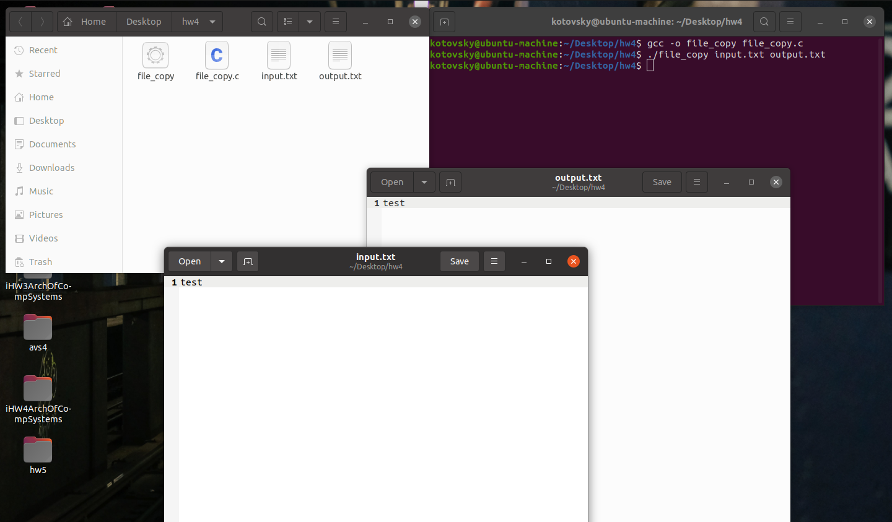

# Домашнее задание №4.
### Котовский Семён Олегович, БПИ-219.

#### Задание:
Разработать программу использующую для работы с текстовыми файлами системные вызовы. Программа на языке C должна прочитать, используя буфер, размер которого превышает читаемые файлы и записать прочитанный файл в файл с другим именем. Имена файлов для чтения и записи задавать с использованием аргументов командной строки.

Использовать для работы с файлами буфер ограниченного размера, требующий циклического использования.

Читать и переписывать не только текстовые, но и исполняемые файлы, включая скрипты, которые сохраняют режим доступа, обеспечивающий их запуск. При этом обычные текстовые файлы запускаться не должны.

#### Примечение по запуску:

Откройте окно терминала и перейдите в каталог, где сохранен файл file_copy.c.

Скомпилируйте программу с помощью следующей команды:
```bash
gcc -o file_copy file_copy.c
```

Теперь вы можете запустить программу с помощью следующей команды:

```bash
./file_copy input_file output_file
```

Здесь input_file - это имя файла, который вы хотите скопировать, а output_file - это имя файла, который вы хотите создать и скопировать в него содержимое.

Например, если вы хотите скопировать файл с именем input.txt в новый файл с именем output.txt, вы можете использовать следующую команду:
```bash
./file_copy input.txt output.txt
```
После этого программа будет выполнена, и когда она завершится, копия файла input.txt должна быть создана как output.txt с теми же разрешениями, что и исходный файл.

#### Программа на языке C, которая читает файл с помощью буфера и записывает его в другой файл с помощью системных вызовов:

```c
#include <stdio.h>
#include <stdlib.h>
#include <fcntl.h>
#include <unistd.h>
#include <sys/stat.h>

#define BUFFER_SIZE 1024

int main(int argc, char *argv[]) {
    int input_fd, output_fd;
    char buffer[BUFFER_SIZE];
    ssize_t bytes_read, bytes_written;
    struct stat input_stat;

    // Check for the correct number of command line arguments
    if (argc != 3) {
        fprintf(stderr, "Usage: %s input_file output_file\n", argv[0]);
        exit(EXIT_FAILURE);
    }

    // Open the input file for reading
    input_fd = open(argv[1], O_RDONLY);
    if (input_fd == -1) {
        perror("open");
        exit(EXIT_FAILURE);
    }

    // Open the output file for writing
    output_fd = open(argv[2], O_CREAT | O_WRONLY, 0644);
    if (output_fd == -1) {
        perror("open");
        exit(EXIT_FAILURE);
    }

    // Get the permissions of the input file
    if (fstat(input_fd, &input_stat) == -1) {
        perror("fstat");
        exit(EXIT_FAILURE);
    }

    // Read from the input file and write to the output file
    while ((bytes_read = read(input_fd, buffer, BUFFER_SIZE)) > 0) {
        bytes_written = write(output_fd, buffer, bytes_read);
        if (bytes_written == -1) {
            perror("write");
            exit(EXIT_FAILURE);
        }
    }

    // Set the permissions of the output file to match the input file
    if (fchmod(output_fd, input_stat.st_mode) == -1) {
        perror("fchmod");
        exit(EXIT_FAILURE);
    }

    // Close the input and output files
    if (close(input_fd) == -1) {
        perror("close");
        exit(EXIT_FAILURE);
    }
    if (close(output_fd) == -1) {
        perror("close");
        exit(EXIT_FAILURE);
    }

    return 0;
}
```

#### Поэтапное объяснение работы программы:

1. Сначала программа проверяет, было ли предоставлено правильное количество аргументов командной строки. Если нет, она выводит сообщение об ошибке и завершает работу.
2. Программа открывает входной файл для чтения с помощью системного вызова open с флагом O_RDONLY.
3. Программа открывает выходной файл для записи с помощью системного вызова open с флагами O_CREAT и O_WRONLY и режимом разрешения 0644 (владелец имеет разрешение на чтение и запись, остальные - только на чтение).
4. Программа использует системный вызов fstat для получения информации о входном файле, включая его режим разрешения.
5. Программа читает входной файл кусками по BUFFER_SIZE байт, используя системный вызов read, и записывает каждый кусок в выходной файл, используя системный вызов write. Это выполняется в цикле до тех пор, пока не будет прочитан весь входной файл.
6. Программа использует системный вызов fchmod для установки режима разрешения выходного файла в соответствии с режимом разрешения входного файла.
7. Программа закрывает входные и выходные файлы с помощью системного вызова close.

### Пример работы:

